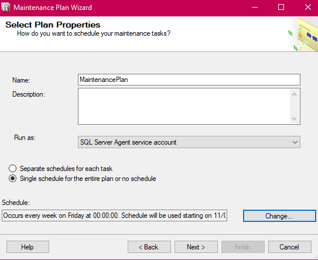

# Databases_laboratories2018
Laboratory nr.1

1.Creați o bază de date plasată fizic în mapa MyDocuments\Data,fixînd o creștere a fișierului primar a bazei de 16MB cu limita de creștere 
de 128MB și a log-ului de 64 MB cu limita de creștere de 1024 MB.Pentru fișierele secundare de 64 MB cu limita de 1024 MB.

2.Creați o bază de date, unde fișierul log sa fie fizic plasat în mapa MyDocuments\Log, numele fișierului log în mediul sistemului de operare trebuie sa se deosebească de cel logic definit în schema fizică. Este important ca baza de date creată să fie compatibilă cu sistemul MS SQL Server 2017 și ea să fie accesibilă numai unui singur utilizator într-un moment de timp.

3.Creați planul de întreținere a bazei de date, construită în sarcina I. Spațiul neutilizat de fișierele bazei de date trebuie îndepartat atunci cand el atinge marimea 2000Mb. Spațiul eliberat trebuie sa fie returnat sistemului de operare. Aceasta operatiune trebuie sa ruleze în fiecare vineri, la ora 00:00. Raportul executarii planului de lntretinere trebuie salvat in dosarul MyDocuments\SQL _event_logs. Inițializați executarea planului. Dupa executare, verificati rezultatele în fișierul log. 

Setăm cînd această operațiune să ruleze,adică în fiecare vineri,la ora 00:00.

Deoarece noi trebuie să restrîngem spațiul de utilizare pentru baza de date,noi folosim Shrink Database:

Selectăm baza de date pentru care vrem să reducem spațiul de utilizare:

Spațiul utilizat de fișierele  bazei de date trebuie îndepărtat  atunci cînd el atinge mărime 2000 Mb. Spațiul eliberat trebuie sa fie returnat sistemului de operare.

Raportul executarii planului de întreținere trebuie salvat in docarul MyDocuments\SQL _event_logs:

Inițializăm executarea planului:

4.Creați planul de întreținere a bazei de date, construite în exercițiul 2. Numele planului va fi: ,,Reconstruire index". În cadrul acestui plan, sistemul trebuie să realizeze reconstruirea indecșilor numai asupra tabelelor de bază (exclusiv viziunilor) din toate schemele care există în baza de date în cauză. Spațiul liber pe pagina trebuie să fie 10%. Sortarea indecșilor trebuie să se realizeze în tempdb.După reconstruire, trebuie sa urmeze colectarea statisticilor complete despre indecșii reconstruiți. Al treilea pas al planului trebuie să constituie sarcina de ștergere a istoriei despre operatiile de Backup-Restore ce au avut loc pe SQL Server. Trebuie șters istoricul care este mai vechi de 6 saptamani. Acest plan trebuie sa fie executat în fiecare prima duminica a lunii. Creați dosarul MyDocuments\SQL_reports. Raportul de executare a planului trebuie sa fie adaugat în acest fișier. Initializați executarea planului. După executare, verificați rezultatele în fișierul log generat.
 
 Numele planului va fi: "Reconstruire index".Acest plan trebuie sa fie executat în fiecare prima duminica a lunii.
 
 
 
 
 Al treilea pas al planului trebuie să constituie sarcina de ștergere a istoriei despre operatiile de Backup-Restore ce au avut loc pe SQL Server. Trebuie șters istoricul care este mai vechi de 6 saptamani. 
 
 
 Spațiul liber pe pagina trebuie să fie 10%.Sortarea indecșilor trebuie să se realizeze în tempdb.
  
  
 
 Creați dosarul MyDocuments\SQL_reports. Raportul de executare a planului trebuie sa fie adaugat în acest fișier.
   
   
   
  
 Inițializăm executarea planului:
   
   
   

  

 

